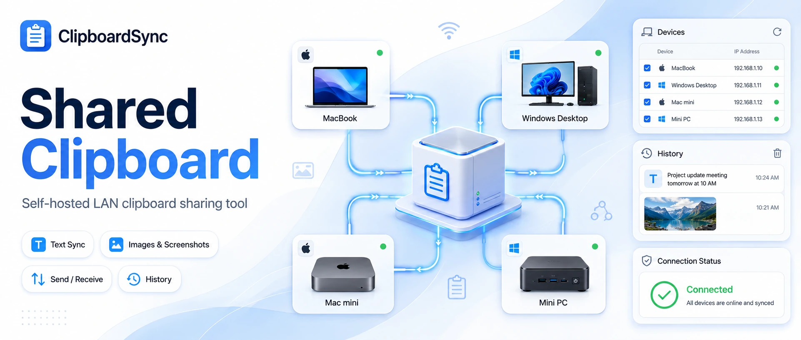
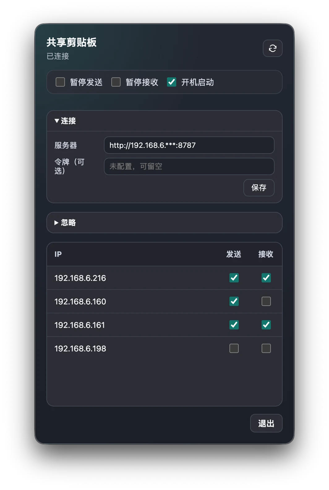
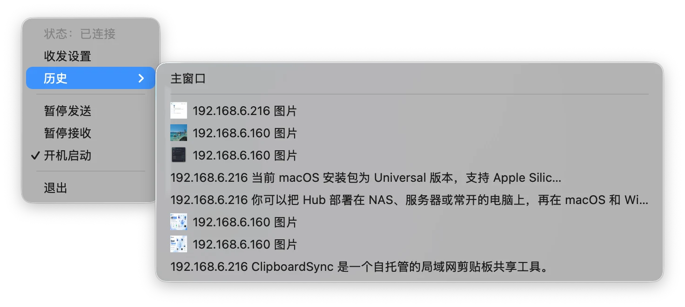
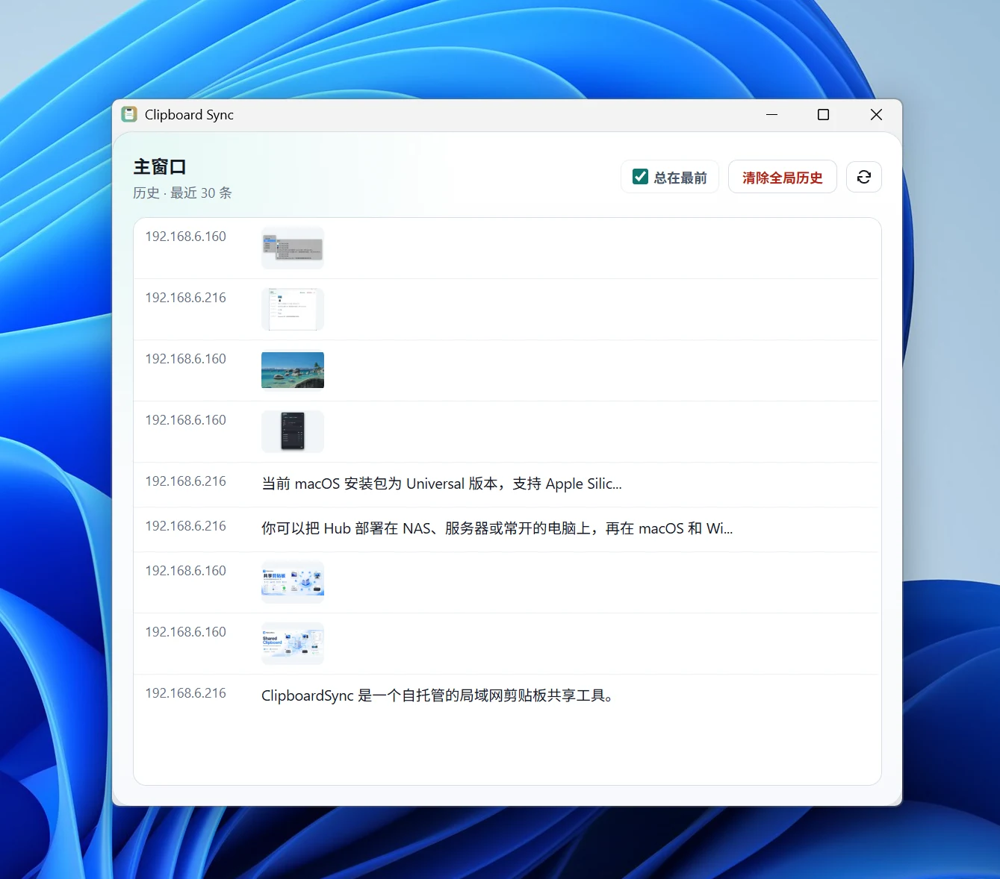

# ClipboardSync

     

[简体中文](README.md) | English



ClipboardSync is a self-hosted LAN clipboard sharing tool. Run the Hub on a NAS, server, or always-on computer, then sync text, links, code snippets, images, and screenshots between macOS and Windows clients.

## Features

- Connect multiple macOS / Windows devices to the same Hub.
- Copy text, links, code snippets, images, or screenshots on one device, then paste directly on another connected device.
- Show devices by IP, with `Send` / `Receive` enabled by default and configurable per device.
- Keep the latest 100 history items by default and show the latest 30 in clients by default. Both values are configured on the Hub.
- Selecting a history item pastes into the current target when possible, or writes it to the local clipboard when no input target is available.
- Support `Pause Sending`, `Pause Receiving`, `Launch at Login`, `Always on Top`, and `Clear Global History`.
- Ignore local copy sources by app name, process name, or window title. Unknown copy sources can also be ignored.

## Demo Screenshots

<p align="center">
  
  
</p>

<p align="center">
  
</p>

## Deploy the Hub

The Hub is the relay service used by all clients. Prepare the project source on a device that can run Docker, then enter the project directory.

### Docker Compose

Copy the environment example:

```bash
cp .env.example .env
```

`.env` contains the following values. `CLIPBOARD_HUB_TOKEN` is optional. Leave it empty for a trusted LAN; set your own value only when you want clients to join with the same token.

```env
CLIPBOARD_HUB_TOKEN=
CLIPBOARD_HUB_BIND_IP=0.0.0.0
CLIPBOARD_HUB_HOST=0.0.0.0
CLIPBOARD_HUB_PORT=8787
CLIPBOARD_HUB_HISTORY_PATH=/data/history.jsonl
CLIPBOARD_HUB_MAX_HISTORY_ENTRIES=100
CLIPBOARD_HUB_HISTORY_DISPLAY_LIMIT=30
CLIPBOARD_HUB_DUPLICATE_CONTENT_WINDOW_MS=30000
```

`docker-compose.yml`:

```yaml
services:
  clipboard-hub:
    build: .
    container_name: clipboard-hub
    restart: unless-stopped
    environment:
      CLIPBOARD_HUB_TOKEN: "${CLIPBOARD_HUB_TOKEN:-}"
      CLIPBOARD_HUB_HOST: "${CLIPBOARD_HUB_HOST:-0.0.0.0}"
      CLIPBOARD_HUB_PORT: "${CLIPBOARD_HUB_PORT:-8787}"
      CLIPBOARD_HUB_HISTORY_PATH: "${CLIPBOARD_HUB_HISTORY_PATH:-/data/history.jsonl}"
      CLIPBOARD_HUB_MAX_HISTORY_ENTRIES: "${CLIPBOARD_HUB_MAX_HISTORY_ENTRIES:-100}"
      CLIPBOARD_HUB_HISTORY_DISPLAY_LIMIT: "${CLIPBOARD_HUB_HISTORY_DISPLAY_LIMIT:-30}"
      CLIPBOARD_HUB_DUPLICATE_CONTENT_WINDOW_MS: "${CLIPBOARD_HUB_DUPLICATE_CONTENT_WINDOW_MS:-30000}"
    ports:
      - "${CLIPBOARD_HUB_BIND_IP:-0.0.0.0}:${CLIPBOARD_HUB_PORT:-8787}:${CLIPBOARD_HUB_PORT:-8787}"
    volumes:
      - ./data:/data
```

Start the Hub:

```bash
docker compose up -d --build
```

### Docker Run

Without Compose, build and run the container directly:

```bash
docker build -t clipboard-hub:local .
docker run -d \
  --name clipboard-hub \
  --restart unless-stopped \
  -p 8787:8787 \
  -e CLIPBOARD_HUB_HOST=0.0.0.0 \
  -e CLIPBOARD_HUB_PORT=8787 \
  -e CLIPBOARD_HUB_HISTORY_PATH=/data/history.jsonl \
  -e CLIPBOARD_HUB_MAX_HISTORY_ENTRIES=100 \
  -e CLIPBOARD_HUB_HISTORY_DISPLAY_LIMIT=30 \
  -e CLIPBOARD_HUB_DUPLICATE_CONTENT_WINDOW_MS=30000 \
  -v "$PWD/data:/data" \
  clipboard-hub:local
```

To require a token, add:

```bash
-e CLIPBOARD_HUB_TOKEN="<your-token>"
```

### NAS Container UI

If you use a NAS container UI, create the container with the same settings:

- Build source: this project directory or this project's `Dockerfile`
- Port: `8787` -> `8787`
- Storage: mount a NAS directory to container `/data`
- Environment: use the fields and values from `.env.example`

## Install the Clients

Download clients from GitHub Releases:

- macOS: [ClipboardSync-mac-universal.dmg](https://github.com/Liu-Bot24/ClipboardSync/releases/latest/download/ClipboardSync-mac-universal.dmg)
- Windows: [ClipboardSync-windows-x64.zip](https://github.com/Liu-Bot24/ClipboardSync/releases/latest/download/ClipboardSync-windows-x64.zip)

### macOS

The macOS package is a Universal build for Apple Silicon and Intel Mac.

1. Open `ClipboardSync-mac-universal.dmg`.
2. Drag `ClipboardSync.app` to `Applications`.
3. Open ClipboardSync from Applications.

If the build is not notarized, macOS may say that it cannot verify the developer or check the app for malware. After confirming that the package came from a trusted source, allow it manually:

1. Confirm that `ClipboardSync.app` is already in `Applications`.
2. Try to open ClipboardSync.
3. When the warning appears, close the warning window. Do not choose `Move to Trash`.
4. Open `System Settings`.
5. Go to `Privacy & Security`.
6. Choose `Open Anyway` next to the security warning.
7. When macOS asks again, choose `Open Anyway`.

After this one-time approval, ClipboardSync can be opened normally.

After dragging the app into `Applications`, use `/Applications/ClipboardSync.app` in Finder as the source of truth. Launchpad or the Apps view may refresh later; if it is not visible there yet, open it directly from Finder.

### Windows

1. Download `ClipboardSync-windows-x64.zip`.
2. Unzip it.
3. Double-click `ClipboardSync.exe`.

## Connect the Clients

In each client, open `Connection` and enter the Hub address:

```text
http://<Hub IP>:8787
```

If the Hub has no token, leave `Token (optional)` empty. If the Hub has `CLIPBOARD_HUB_TOKEN`, enter the same value in the client.

After saving, the client status should show `Connected`, and the shared clipboard is ready to use between connected devices.
