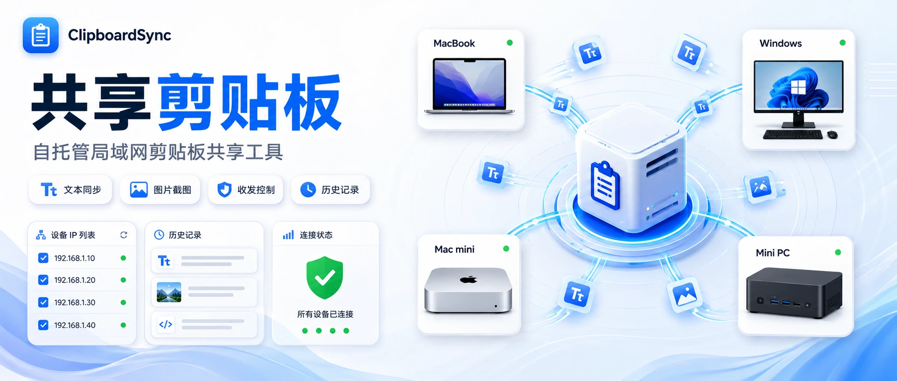

# ClipboardSync

     

简体中文 | [English](README.en.md)



ClipboardSync 是一个自托管的局域网剪贴板共享工具。你可以把 Hub 部署在 NAS、服务器或常开的电脑上，再在 macOS 和 Windows 客户端之间同步文本、链接、代码片段、图片和截图。

## 功能

- 支持多台 macOS / Windows 设备连接同一个 Hub。
- 在一台设备复制文本、链接、代码片段、图片或截图后，可以直接在另一台已连接设备粘贴。
- 设备按 IP 显示，`发送` / `接收` 默认开启，可按设备单独控制。
- Hub 默认保留最近 100 条历史，客户端默认显示最近 30 条；这两个数量都可以在 Hub 配置里调整。
- 点击历史时，有输入目标就直接粘贴，没有输入目标就写入本机剪贴板。
- 支持 `暂停发送`、`暂停接收`、`开机启动`、`总在最前` 和 `清除全局历史`。
- Windows 支持按应用名、进程名或窗口标题忽略本机复制来源，也可忽略未知来源。macOS 暂不支持来源识别，对应筛选不可用。

### 同步与保留边界

新客户端用发送操作 ID 重试，独立复制即使内容相同也会分别同步。建议同时升级 Hub 和客户端；旧 Hub 的内容去重规则仍可能影响新客户端。`CLIPBOARD_HUB_DUPLICATE_CONTENT_WINDOW_MS` 保留配置兼容性，但新 Hub 不再用它吞掉同内容的独立操作。

暂停、停止服务、切换连接或选择新历史会使旧写入任务失效。自动粘贴仅在对应写入确认后执行；Windows 激活目标失败或最终窗口不匹配时，会保留剪贴板内容而停止自动粘贴。

图片最大编码大小为 32 MiB，最多 64 × 1024 × 1024 像素、单边不超过 32768。像素预算按单份 RGBA 图像约 256 MiB 计算，不代表进程总内存上限。超过预算的图片不会进入客户端原生解码或缩略图路径。

历史字节预算按完整 JSONL 记录计算，包括 Base64 和元数据。单条记录超过 `CLIPBOARD_HUB_MAX_HISTORY_BYTES` 时，Hub 会明确拒绝接收。历史条数和过期限制对查询立即生效，文件压缩按阈值或最长约 60 秒的维护间隔执行。维护失败可从 `/health` 的 `historyMaintenance` 字段查看；已提交事件仍可同步，后续新事件在存储恢复前会收到错误。重连后可通过历史找回仍在保留范围内的记录。

设备 ID 和共享 Token 用于可信设备间连接与路由，不是独立设备身份认证。HTTP 传输与 JSONL 历史均不提供内容加密；跨不可信网络访问应使用 HTTPS 或可信隧道，并限制历史目录权限。

## 演示截图

<p align="center">
  
  
</p>

<p align="center">
  
</p>

## 部署 Hub

Hub 是所有客户端连接的中转服务。先在能够运行 Docker 的设备上准备项目源码，然后进入项目目录。

### Docker Compose

复制环境变量示例：

```bash
cp .env.example .env
```

`.env` 内容如下。`CLIPBOARD_HUB_TOKEN` 是可选项，纯局域网可信环境可以留空；需要口令时，填一个你自己决定的值，并在客户端里填写同一个值。

```env
CLIPBOARD_HUB_TOKEN=
CLIPBOARD_HUB_BIND_IP=0.0.0.0
CLIPBOARD_HUB_HOST=0.0.0.0
CLIPBOARD_HUB_PORT=8787
CLIPBOARD_HUB_HISTORY_PATH=/data/history.jsonl
CLIPBOARD_HUB_MAX_HISTORY_ENTRIES=100
CLIPBOARD_HUB_HISTORY_DISPLAY_LIMIT=30
CLIPBOARD_HUB_DUPLICATE_CONTENT_WINDOW_MS=30000
```

`docker-compose.yml`：

```yaml
services:
  clipboard-hub:
    build: .
    container_name: clipboard-hub
    restart: unless-stopped
    environment:
      CLIPBOARD_HUB_TOKEN: "${CLIPBOARD_HUB_TOKEN:-}"
      CLIPBOARD_HUB_HOST: "${CLIPBOARD_HUB_HOST:-0.0.0.0}"
      CLIPBOARD_HUB_PORT: "${CLIPBOARD_HUB_PORT:-8787}"
      CLIPBOARD_HUB_HISTORY_PATH: "${CLIPBOARD_HUB_HISTORY_PATH:-/data/history.jsonl}"
      CLIPBOARD_HUB_MAX_HISTORY_ENTRIES: "${CLIPBOARD_HUB_MAX_HISTORY_ENTRIES:-100}"
      CLIPBOARD_HUB_HISTORY_DISPLAY_LIMIT: "${CLIPBOARD_HUB_HISTORY_DISPLAY_LIMIT:-30}"
      CLIPBOARD_HUB_DUPLICATE_CONTENT_WINDOW_MS: "${CLIPBOARD_HUB_DUPLICATE_CONTENT_WINDOW_MS:-30000}"
    ports:
      - "${CLIPBOARD_HUB_BIND_IP:-0.0.0.0}:${CLIPBOARD_HUB_PORT:-8787}:${CLIPBOARD_HUB_PORT:-8787}"
    volumes:
      - ./data:/data
```

启动 Hub：

```bash
docker compose up -d --build
```

### Docker Run

不使用 Compose 时，可以直接构建并启动：

```bash
docker build -t clipboard-hub:local .
docker run -d \
  --name clipboard-hub \
  --restart unless-stopped \
  -p 8787:8787 \
  -e CLIPBOARD_HUB_HOST=0.0.0.0 \
  -e CLIPBOARD_HUB_PORT=8787 \
  -e CLIPBOARD_HUB_HISTORY_PATH=/data/history.jsonl \
  -e CLIPBOARD_HUB_MAX_HISTORY_ENTRIES=100 \
  -e CLIPBOARD_HUB_HISTORY_DISPLAY_LIMIT=30 \
  -e CLIPBOARD_HUB_DUPLICATE_CONTENT_WINDOW_MS=30000 \
  -v "$PWD/data:/data" \
  clipboard-hub:local
```

需要口令时，在 `docker run` 里增加：

```bash
-e CLIPBOARD_HUB_TOKEN="<your-token>"
```

### NAS 容器界面

如果使用 NAS 的容器管理界面，按同样的配置创建容器：

- 构建来源：本项目目录或本项目的 `Dockerfile`
- 端口：`8787` -> `8787`
- 存储：把 NAS 上的一个目录挂载到容器 `/data`
- 环境变量：使用 `.env.example` 里的字段和值

## 安装客户端

从 GitHub Release 下载客户端：

- macOS：[ClipboardSync-mac-universal.dmg](https://github.com/Liu-Bot24/ClipboardSync/releases/latest/download/ClipboardSync-mac-universal.dmg)
- Windows：[ClipboardSync-windows-x64.zip](https://github.com/Liu-Bot24/ClipboardSync/releases/latest/download/ClipboardSync-windows-x64.zip)

### macOS

当前 macOS 安装包为 Universal 版本，支持 Apple Silicon 和 Intel Mac。

1. 打开 `ClipboardSync-mac-universal.dmg`。
2. 将 `ClipboardSync.app` 拖到 `Applications`。
3. 从 `Applications` 打开 ClipboardSync。

未公证版本首次打开时，macOS 可能会提示无法验证开发者或无法检查 App 是否包含恶意软件。确认安装包来源可信后，可以手动允许打开：

1. 确认 `ClipboardSync.app` 已经在 `Applications` 中。
2. 尝试打开 ClipboardSync。
3. 看到无法验证的提示后，关闭提示窗口，不要选择 `移到废纸篓`。
4. 打开 `系统设置`。
5. 进入 `隐私与安全性`。
6. 在安全提示旁选择 `仍要打开`。
7. macOS 再次弹出确认提示时，选择 `仍要打开`。

通过一次后，macOS 会记住这次例外，后续可以正常双击打开。

拖入 `Applications` 后，安装是否成功以 `/Applications/ClipboardSync.app` 是否存在、能否从 Finder 打开为准。启动台或新版 macOS 的 Apps 视图可能不会立即刷新；如果暂时看不到，可以先直接从 Finder 的 `Applications` 目录打开。

### Windows

1. 下载 `ClipboardSync-windows-x64.zip`。
2. 解压 ZIP。
3. 双击 `ClipboardSync.exe`。

## 连接客户端

在每台客户端的 `连接` 里填写 Hub 地址：

```text
http://<Hub IP>:8787
```

如果 Hub 没有配置 token，客户端的 `令牌（可选）` 留空。如果 Hub 配置了 `CLIPBOARD_HUB_TOKEN`，客户端填写同一个值。

保存后，客户端状态显示为 `已连接`，就可以在已连接设备之间使用共享剪贴板。
